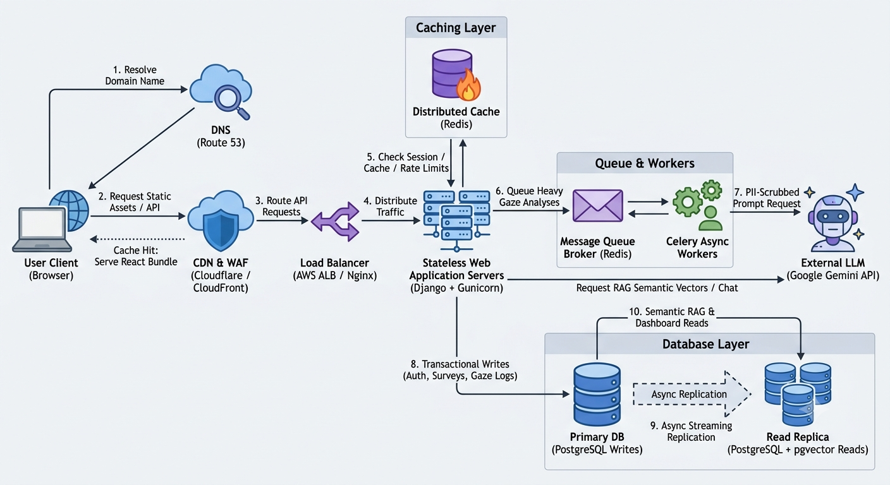
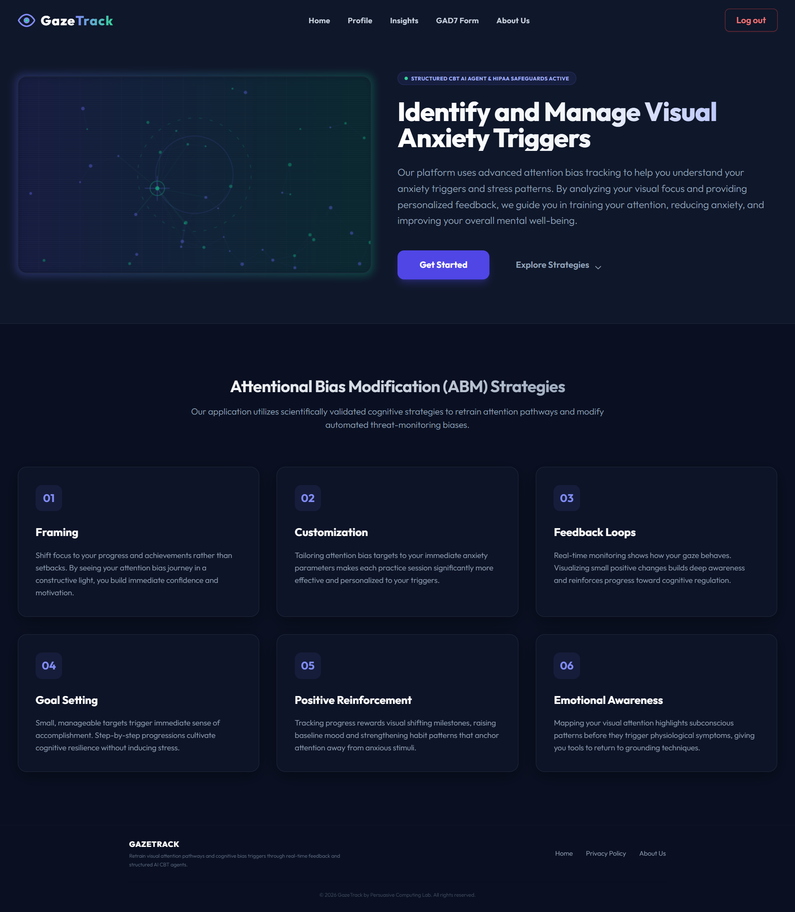
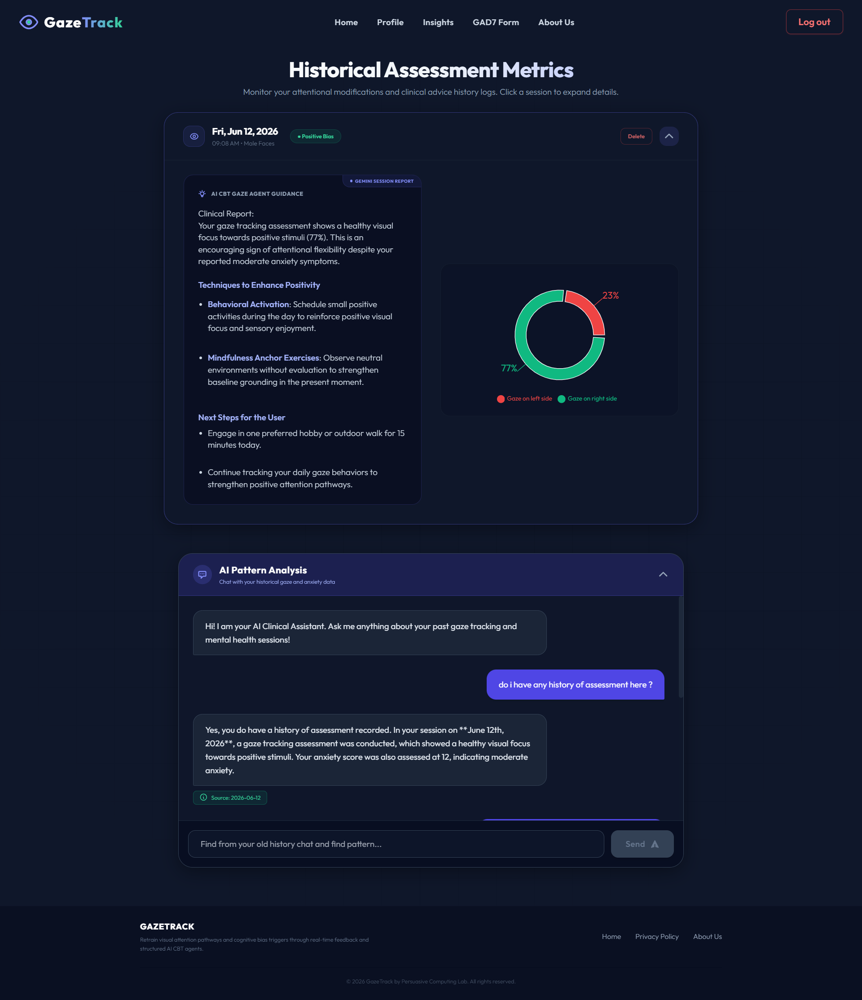
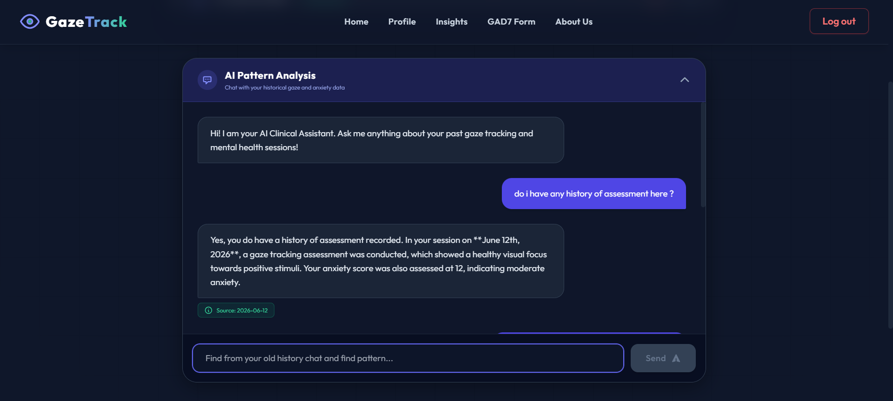
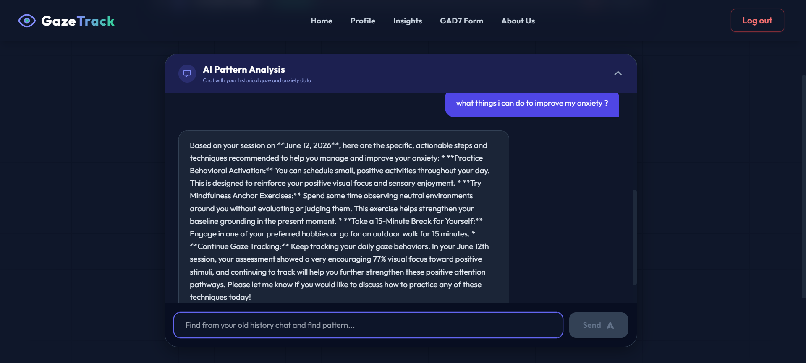

# GazeTrack — Agentic Cognitive Attention Health Platform

GazeTrack is a fully automated, highly secure web application that enables users to track and improve their cognitive attention health independently, without requiring direct human clinical supervision. By integrating browser-native gaze tracking with evidence-based Attention Bias Modification (ABM) techniques, the system automatically analyzes user visual focus, maps potential threat-monitoring anxiety triggers, and suggests personalized coping exercises. 

By prioritizing patient privacy and compliance (utilizing de-identified server-side Agent flows and full clinical record hard-deletes), GazeTrack provides a safe, private space for individuals to evaluate their mental wellness. Through automated GAD-7 assessments, interactive visual exercises, and an AI-driven historical feedback engine (RAG), users can review their progress, perform daily cognitive adjustments, and progressively build resilience against stress and anxiety over time.

---

## Key Objectives & Clinical Goals

- **Secure Session Management & Onboarding**: Implements secure user authentication (JWT-based token system) to protect sensitive assessment histories.
- **Mental Health Baseline (GAD-7 Form)**: Conducts a mandatory GAD-7 anxiety survey to establish a baseline clinical score before gaze assessments.
- **Precision Gaze Calibration**: Integrates an interactive gaze calibration tool using browser-based face mesh mapping to align tracking boundaries.
- **Transition-Aware Gaze Evaluation**: Executes a viewport-aware coordinate analysis algorithm that filters off-screen noise and central dead-zone transitions, isolating visual focus splits (threat vs. positive stimuli).
- **Clinical CBT Recommendation Agent**: Utilizes Gemini LLM orchestration to generate de-identified, context-sensitive CBT & ABM exercises.
- **Context-Aware Semantic Chat (RAG)**: Integrates a Retrieval-Augmented Generation chat system, embedding user sessions and using L2 vector similarity to provide historical progress analysis.

---

## Core System Architectures

### 1. Agentic AI: The CBT Gaze Agent

GazeTrack utilizes a secure, server-side **CBT Gaze Agent** powered by the **Google Gemini API** to analyze user attention patterns and generate personalized cognitive guidance.

```
[Raw Coordinates + Viewport Sizes]
             │
             ▼
[Django Attentional Bias Service]  ──> Calculates Attentional Bias Indices
             │
             ▼
[CBT Gaze Agent (Gemini API)] ──> Ingests scores + GAD-7 baseline history
             │
      ┌──────┴────────────────────────┐
      ▼                               ▼
[Clinical Reasoning Report]     [Structured CBT Guidance]
      │                               │
      └──────┬────────────────────────┘
             ▼
[Strict JSON Schema Validation] ──> Saves response safely to database
```

* **Viewport-Aware Calculation:** The backend parses coordinate sequences alongside dynamic client viewport boundaries to discount outlier coordinates and central dead-zone noise (5% margins), calculating precise Left (Negative) vs. Right (Positive) attentional bias ratios.
* **HIPAA Safe Harbor De-identification:** To guarantee absolute patient confidentiality, the backend strips all Personally Identifiable Information (PII) and Protected Health Information (PHI) from the payload before querying the external API. Names, emails, and usernames are completely removed, replacing them with a randomized pseudonymous subject ID: `Patient Ref: PATIENT-{user_profile.id}`.
* **Strict Schema Constraints:** The CBT Gaze Agent enforces Google Gemini's native JSON schema validation. The model is strictly constrained to output:
  - `clinical_assessment`: Summary of Left/Right attention bias correlations to GAD-7 levels.
  - `attention_bias_ratio`: Calculated ratio (0.0 to 1.0) of gaze captures on threat stimuli.
  - `cognitive_techniques`: Object array mapping specific, actionable CBT or Attentional Bias Modification (ABM) exercises.
  - `actionable_next_steps`: List of daily visual training guidelines.
* **Persuasive Prompt Framing:** Prompts leverage evidence-based cognitive conditioning (Framing, Tailoring, and Feedback Loops) to guide the patient away from threat-monitoring habits toward neutral or positive anchors.

### 2. Retrieval-Augmented Generation (RAG) Engine

The Semantic Chat system uses a RAG pipeline to ground the conversational AI in the user's historical clinical results without exposing sensitive data:

```
                  [User Chat Query]
                          │
                          ▼
             [Gemini Embeddings Engine]
                          │ (768-dim Vector)
                          ▼
            [L2 Distance Vector Search]
  (Queries pgvector / Local Euclidean Search Index)
                          │
                          ▼
             [Relevant Session Context]
                          │
                          ▼
             [Augmented LLM Prompt] ──> [Safe & Personalized Output]
```

* **Vector Embedding Generation**: The backend captures new clinical assessments and uses the Gemini API embedding model to generate 768-dimensional vector representations.
* **Semantic Retrieval**: When the user asks the chat system about their progress, the query is vectorized and compared against their past assessments using an L2 Euclidean distance vector calculation (`L2Distance` in `pgvector`).
* **Context-Driven Chat**: The closest matching historical records are retrieved and stuffed into the context window of the chat model, enabling highly accurate, personalized, and grounded responses about their clinical progress over time.

---

## Production System Design

To ensure high availability, security, low latency, and clinical-grade reliability, the production system is designed with a horizontally scalable, multi-tier micro-services architecture:




### 1. DNS Resolution & CDN Routing
* **Domain Name System (DNS)**: Route 53 resolves requests, routing user traffic dynamically to the nearest edge location.
* **Content Delivery Network (CDN) & WAF**: Cloudflare acts as the Web Application Firewall (WAF) and static content distributor. React frontend bundles (HTML/JS/CSS) and stimuli assets are cached at CDN edges for sub-millisecond delivery, while dynamic API calls (`/api/*`) are forwarded to the load balancer.

### 2. Load Balancing & SSL Termination
* **Load Balancer**: AWS Application Load Balancer (ALB) or Nginx acts as the single point of entry for backend services, terminating SSL/TLS certificates and distributing traffic across healthy stateless app servers.

### 3. Stateless Application Clusters
* **App Server (Django & Gunicorn)**: Standardizes and computes user requests. These instances are fully stateless, meaning they can scale horizontally (scale-out) based on CPU/Memory load triggers without affecting ongoing user sessions.

### 4. Distributed In-Memory Cache
* **Cache Node (Redis)**: Stores session tokens, user metadata, and dynamic feature configurations to minimize database hits. It also handles distributed rate limiting to prevent brute-force attacks and API abuse.

### 5. Task Queue & Background Processing
* **Broker & Workers (Celery & Redis)**: Long-running computational processes, such as analyzing hundreds of viewport coordinates and querying external Gemini models for CBT reports, are run out-of-band. Django drops a message to the Redis Broker, Celery workers pick it up, execute the task, and save the result to the database asynchronously.

### 6. Primary-Replica Database Architecture
* **Primary PostgreSQL Database**: Handles all data-modifying commands (write/update/delete operations) to guarantee ACID compliance and write consistency.
* **PostgreSQL Read Replica**: Reads are distributed across replicas to scale database IOPS. It maintains the `pgvector` indexes (`IVFFlat` or `HNSW`) and processes all historical progress queries and semantic vector space distance calculations.

---

## REST API Reference

The communication between the React frontend and Django backend follows standard REST principles, using appropriate HTTP status codes to signal success, client errors, or server issues.

### HTTP Status Code Standards
* **`200 OK`**: Successful request returning expected payload (e.g., retrieving gaze assessments, loading profiles).
* **`201 Created`**: Successful creation of a new resource (e.g., registration, adding stimuli, submitting a GAD-7 baseline).
* **`400 Bad Request`**: Client-side parameter issues, validation failures, or malformed JSON payloads.
* **`401 Unauthorized`**: Missing, invalid, or expired JWT credentials.
* **`403 Forbidden`**: Permissions check failure (e.g., attempting to access or modify data belonging to another subject ID).
* **`404 Not Found`**: The requested resource does not exist (e.g., prediction ID or configuration parameters missing).
* **`500 Internal Server Error`**: Unexpected backend exceptions or failure of external services (e.g., Gemini API outage fallbacks).

## Core Technologies & Frameworks

* **Frontend Engine**: React.js, Tailwind CSS for visual alignment and layout, and Google MediaPipe for client-side face mesh tracking.
* **Backend Framework**: Django & Django REST Framework (DRF) running Python.
* **Database & Indexing**: PostgreSQL with `pgvector` (Vector similarity search), and an SQLite-compatible Euclidean search index fallback.
* **Orchestration & LLM**: Google Gemini API (utilizing `gemini-1.5-flash` or similar models) for structured JSON generation and vector embeddings.
* **Routing & Load Balancing**: Nginx and AWS Application Load Balancer.
* **Task Queues & Caching**: Redis (cache and Celery broker) + Celery workers.

---

## Application Showcase

### Home Page (Interactive Dashboard)


### Analytics Page (Biometric & Attention Bias Tracking)


### RAG Chat Interface (Semantic Historical Guidance)



---

## Author

* **Shubham** — [shubhamjethva92@gmail.com](mailto:shubhamjethva92@gmail.com) *(Maintainer)*